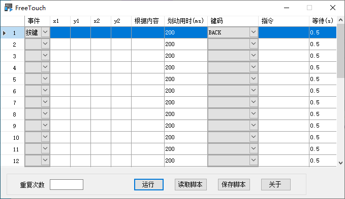

**FreeTouch 是一个基于 Android 调试桥实现的，可以用于辅助完成安卓手机一些操作的软件。**  

**使用方法：**  

1. 通过数据线将手机与电脑连接。  

2. 在手机设置中的“开发者选项”中打开USB调试功能。“开发者选项”在默认情况下处于隐藏状态。要将其显示出来，需要依次转到 设置 > 我的设备 > 全部参数，最后进入到下图所示界面，再连续点击系统版本号。  
   
     

3. 设置开发者选项  
   (1)依次转到 设置 > 更多设置 > 开发者选项，开启开发者选项;  
   (2)在开发者选项界面下找到并打开USB调试选项。  
   (3)如果选项列表中还存在“USB调试（安全设置）允许通过USB调试…模拟点击”或类似的选项，请打开该选项。否则只需打开USB调试选项。  
   
     

4. 以通过此程序使手机执行返回操作为例,应设置的内容如下  
   (1)在程序界面表格的第一行，点击“事件”列下拉框，选择“按键”；  
   (2)在“键码”列下拉框中选择“BACK”，该键码表示返回；  
   (3)在正确连接手机的情况下，点击“运行”按钮，该手机将会执行返回操作。  
   
     
